# INSTALLATION

## Download Big Sur 

Run this command on Temrinal:

    sudo /System/Library/PrivateFrameworks/Seeding.framework/Resources/seedutil enroll DeveloperSeed

Go to System Updater and download the Install macOS Beta app.

## Create bootable ISO file

    hdiutil create -size 12G -fs hfs+ -volname install -type SPARSEBUNDLE ~/Desktop/install
    hdiutil attach ~/Desktop/install.sparsebundle
    sudo /Applications/Install\ macOS\ Beta.app/Contents/Resources/createinstallmedia --volume /Volumes/install --nointeraction
    hdiutil detach `diskutil list |grep 'Install macOS Beta' |awk '{print $8}'` -force
    hdiutil makehybrid -o ~/Desktop/install ~/Desktop/install.sparsebundle
    rm -rf ~/Desktop/install.sparsebundle

## Create the virtual machine and install to disk/SSD
Download and install the trial version of the VMware Fusion from their site. I'm used the version 11.5.5.

- Create a custom virtual machine
    

- Operating System: Apple OS X - macOS 10.15
    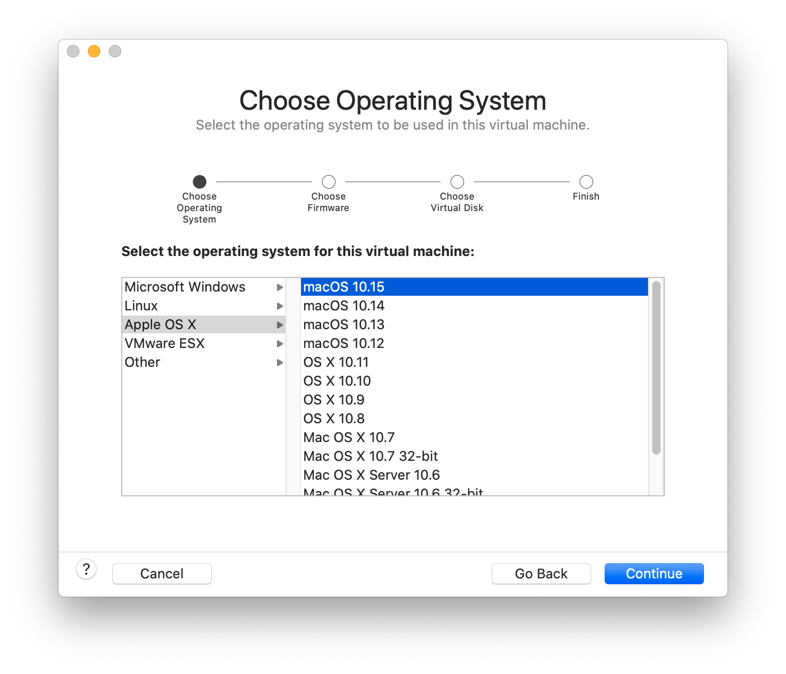

- Create a new virtual disk (The size doesn't matter, We'll delete later)
    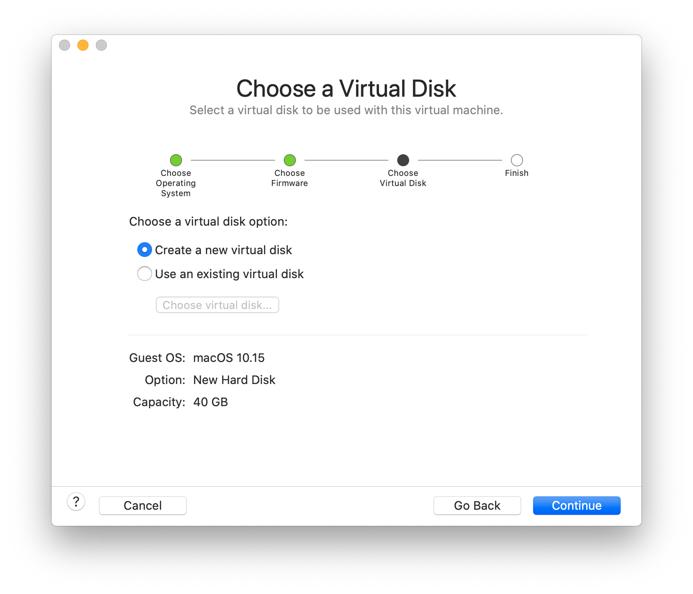

- Click in "Customize Settings"
    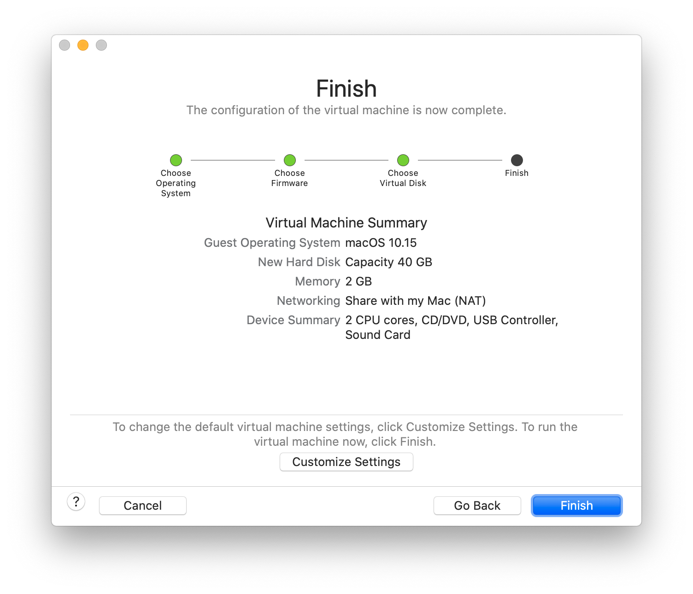

- Save the VM on desktop with name: bigsur
    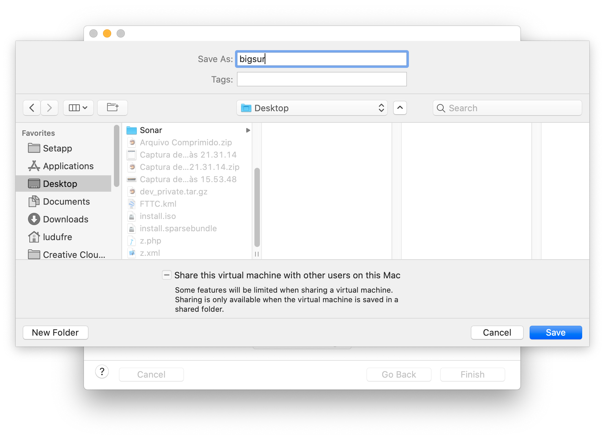

- Insert the spare disk/SSD on PC (reboot if necessary) and identify what /dev/diskX is.

You can look on Disk Utility.app:
    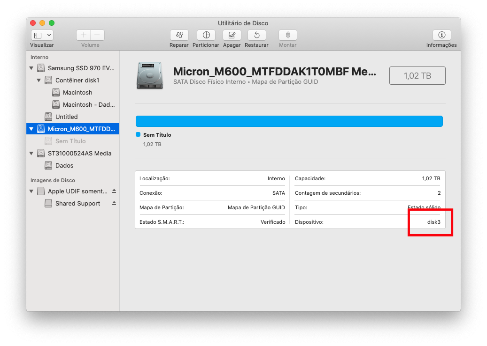

- Create VMDK that point to it:
    
    `sudo diskutil unmountDisk diskX /Applications/VMware\ Fusion.app/Contents/Library/vmware-rawdiskCreator create /dev/diskX fullDevice ~/Desktop/bigsur.vmwarevm/physical sata`

- Edit the virtual machine settings created previously
    

- Click in Hard Disk (SATA) and delete it (Remove Hard Disk)
    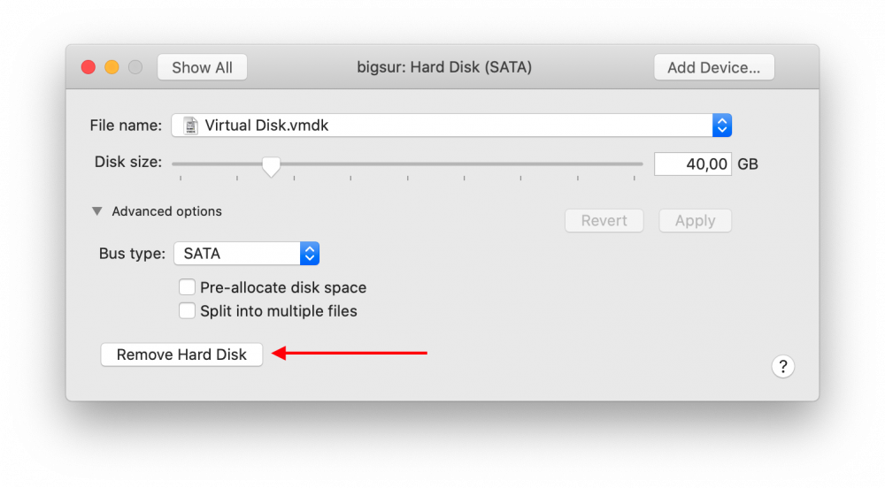

- Then add the physical disk
    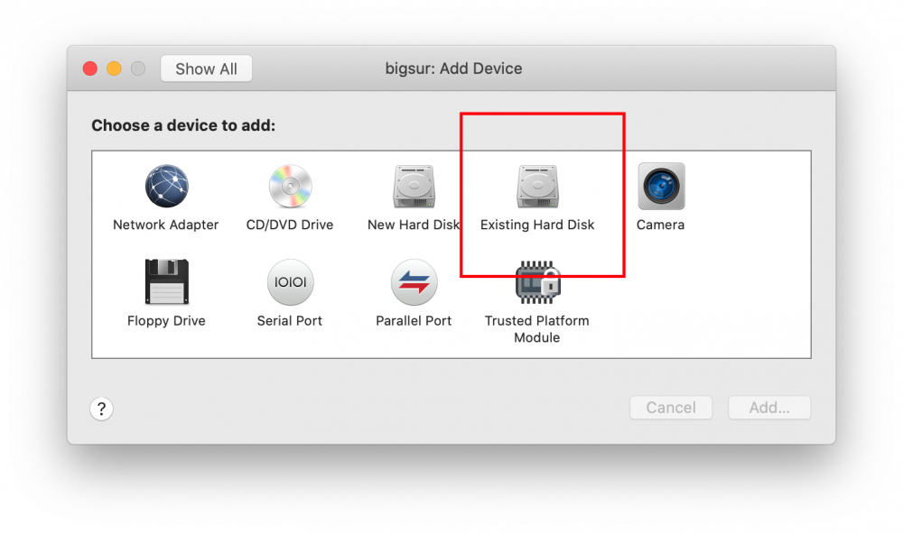

- There's a bug in Fusion. To select the physical.vmdk, right click then "Quick Look", then "Share virtual disk with the virtual machine that created it"
    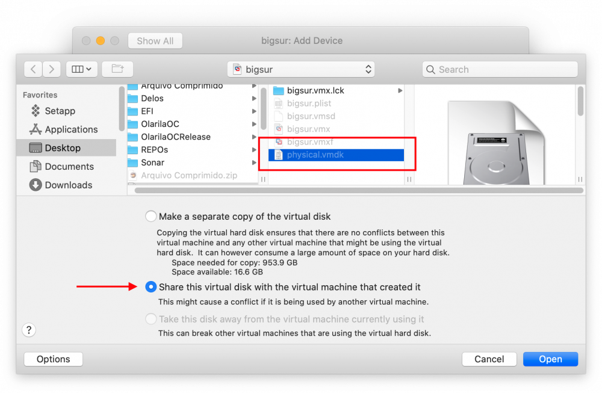

- Click Apply.
    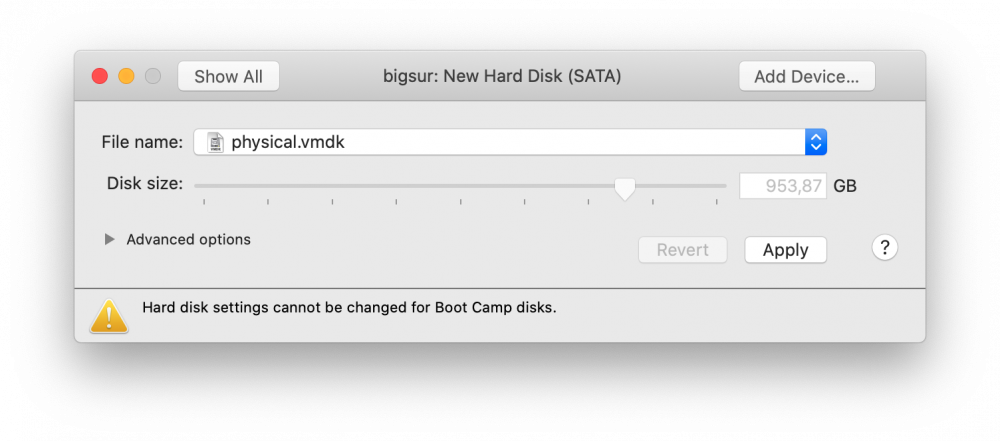

- Mount the install.iso
  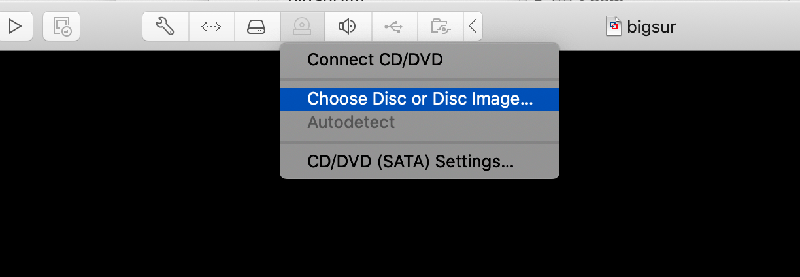
  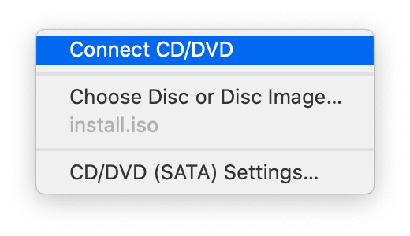

- Start the VM and install as usual until: Disk Utility, format GUID with APFS (VMware Virtual SATA Hard Drive Media), Install macOS, wait few reboots and stop at first boot wizard.

    **Warning**: This can take up to 45 minutes. It may seem like it is stopped, but it is not.

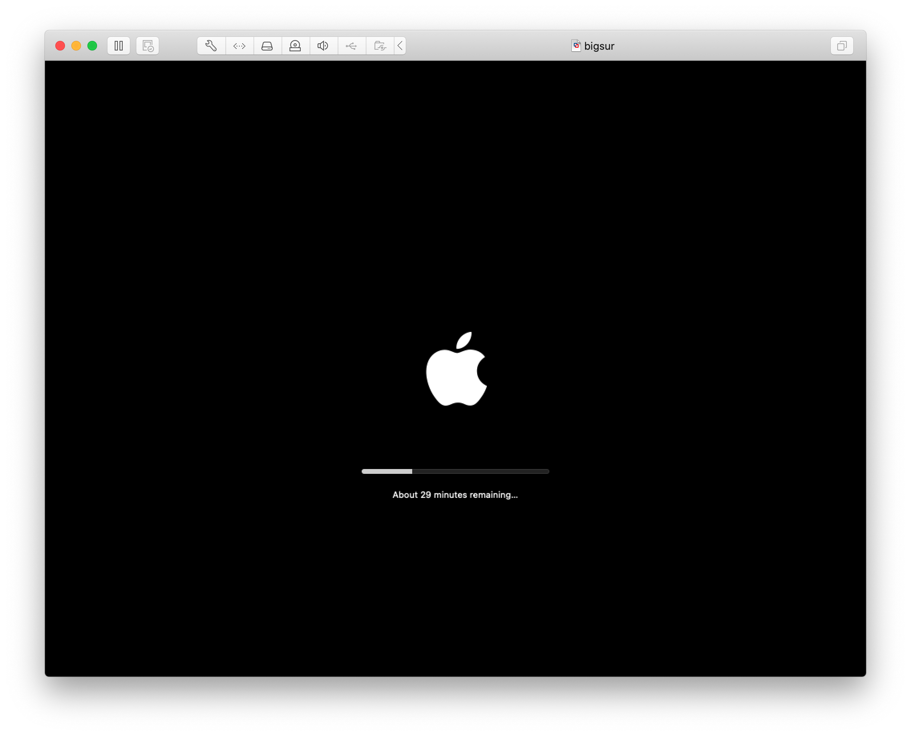

- Press Command + Q and shutdown (usually WIN + Q)
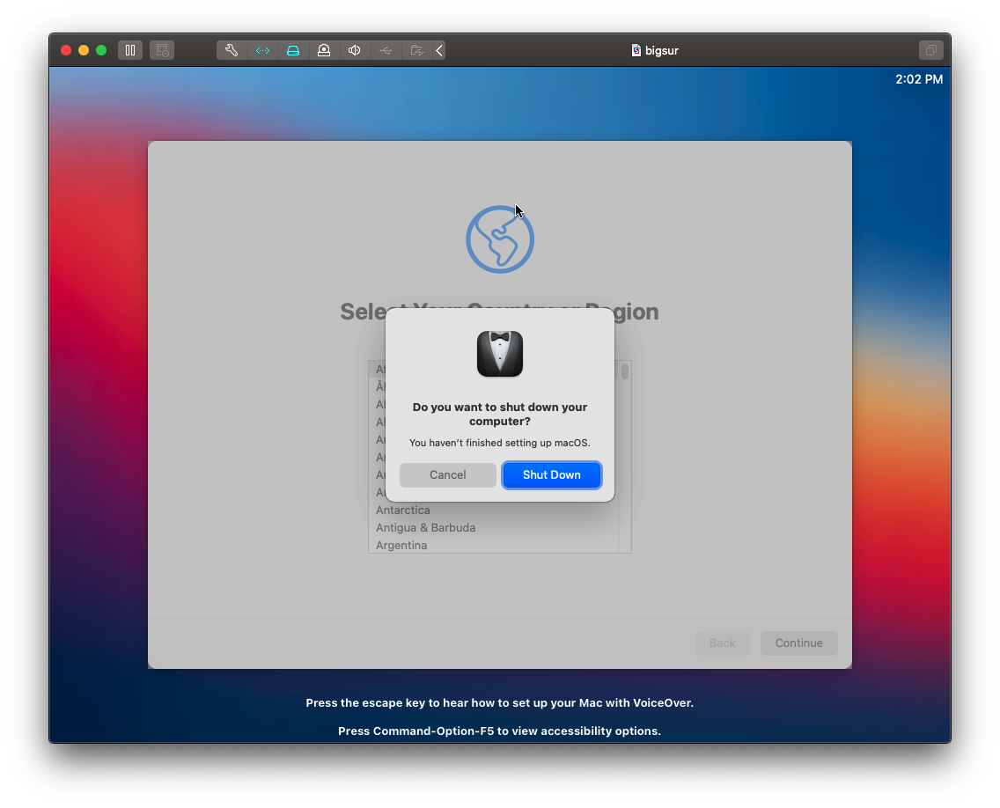
- Close VMware Fusion.

## Copy OpenCore to EFI
Mount the EFI with:
    
    sudo diskutil mount diskXs1

## Done
Boot from the new disk/SSD and finish de first boot wizard.

# Thanks
- [ludufre](https://www.insanelymac.com/forum/topic/344299-guide-gigabyte-ga-z370n-wifi-i7-8700k-uhd-630-big-sur-110-dp1/)

